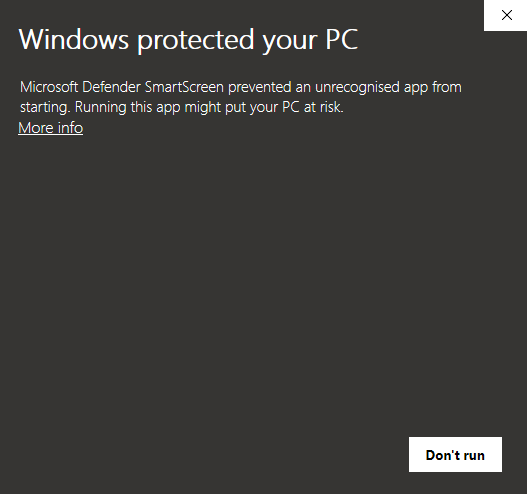
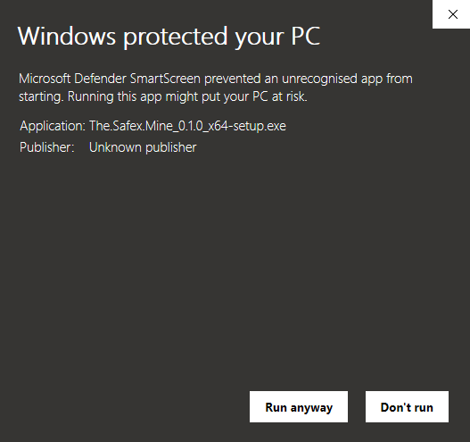
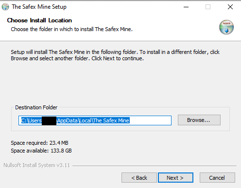
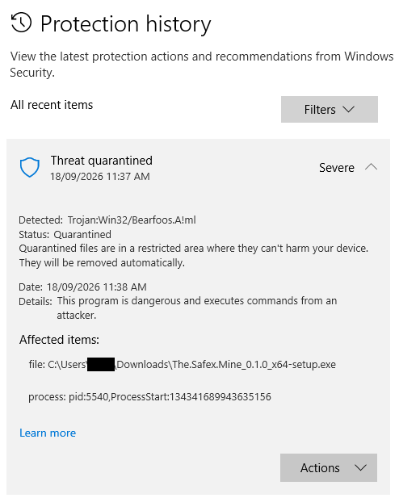
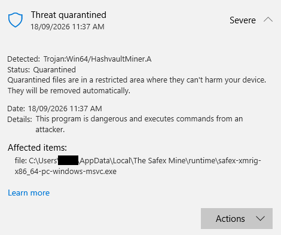
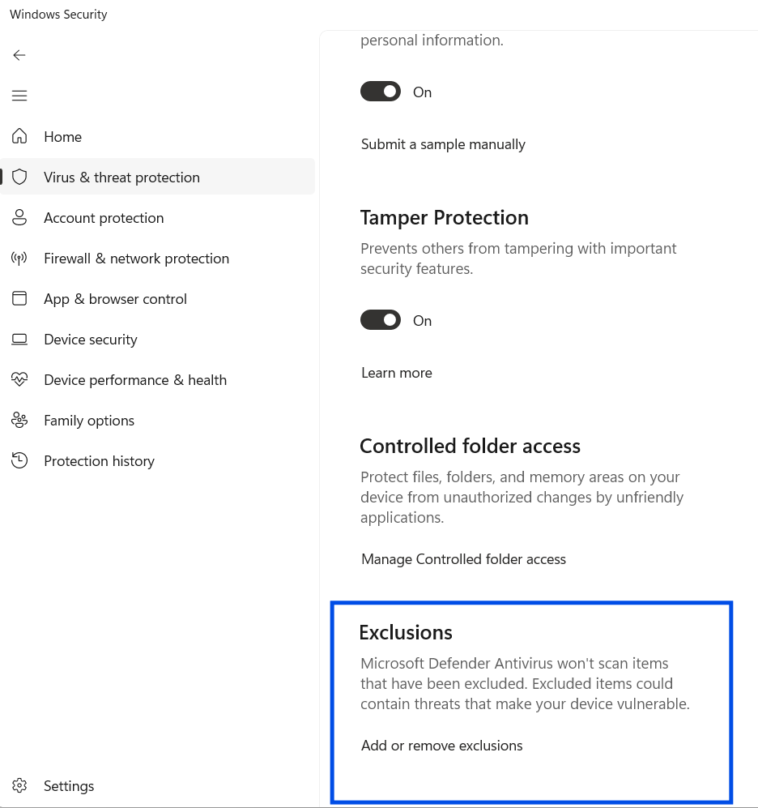

# Windows Installation Guide

The Safex Mine is an unsigned Windows application that includes a CPU-mining backend, an elevated helper and the WinRing driver used for XMRig MSR optimisation. Windows SmartScreen and antivirus products may therefore warn about or quarantine parts of the release.

This guide describes the installation path observed during clean-machine testing with Microsoft Defender. Other Windows versions or antivirus products may present different wording or detection names.

## 1. Download the official release

Download the Windows installer only from the official **The Safex Mine** GitHub release.

The public Windows release contains one installer:

```text
The Safex Mine_<version>_x64-setup.exe
```

The release also publishes a SHA-256 checksum for that exact installer.

## 2. Verify the SHA-256 checksum

Before running the installer, verify that the downloaded file matches the checksum published with the release.

Open PowerShell and run:

```powershell
cd $HOME\Downloads
Get-FileHash ".\The Safex Mine_<version>_x64-setup.exe" -Algorithm SHA256
```

Compare the reported hash carefully with the SHA-256 published on the GitHub release.

If antivirus software quarantines the installer before you can calculate its checksum, restore/allow **that specific downloaded installer**, calculate its SHA-256, and do not execute it unless the hash matches the official release checksum.

## 3. Windows SmartScreen

Because the public build is unsigned, Microsoft Defender SmartScreen may display:

> Windows protected your PC

During clean-machine testing, the first SmartScreen page showed **More info**.



*SmartScreen may initially show **Windows protected your PC**. Select **More info** to inspect the application details before deciding whether to continue.*

Selecting **More info** displayed the application filename, **Publisher: Unknown publisher**, and a **Run anyway** button.



*The expanded SmartScreen view identifies the unsigned build as **Unknown publisher** and exposes **Run anyway**.*

Only continue after verifying that the installer came from the official release and that its SHA-256 matches the published checksum.

## 4. Install The Safex Mine

The NSIS installer uses a per-user installation. Clean-machine testing confirmed the default destination:

```text
%LOCALAPPDATA%\The Safex Mine
```

For a typical Windows account that resolves to:

```text
C:\Users\<username>\AppData\Local\The Safex Mine
```

The installer itself did **not** require UAC during the clean-machine test.



*The tested NSIS installer uses the current user's Local AppData folder by default.*

Allow the installer to complete normally.

## 5. Microsoft Defender quarantine

Mining software is commonly classified or quarantined by antivirus products. Do not assume that every detection is safe merely because it appeared during installation.

On the verified clean-machine test build, Microsoft Defender produced two relevant detections:

- the downloaded installer was quarantined under the label `Trojan:Win32/Bearfoos.A!ml`;
- the installed XMRig backend at `%LOCALAPPDATA%\The Safex Mine\runtime\safex-xmrig-x86_64-pc-windows-msvc.exe` was quarantined under the label `Trojan:Win64/HashvaultMiner.A`.

Detection names may change between Defender versions and other antivirus products.



*Clean-machine testing observed Defender quarantining the downloaded installer. Check the affected filename and path before restoring anything.*



*Defender also quarantined the packaged XMRig backend in the installed `runtime` folder during the clean-machine test.*

Before restoring anything, confirm that the affected file and path match an expected The Safex Mine component.

For Microsoft Defender:

1. open **Windows Security**;
2. open **Virus & threat protection**;
3. open **Protection history**;
4. inspect the affected item and path;
5. restore/allow only the expected verified installer or runtime component.

If the installer has already completed successfully, restoring the quarantined copy in Downloads is not required for the installed application to operate. The installed XMRig backend, however, must be present for mining to run.

## 6. Add a narrow Defender exclusion if required

After verifying the release and restoring the expected mining runtime, add an exclusion for **only** the dedicated installation folder:

```text
%LOCALAPPDATA%\The Safex Mine
```

Do **not** exclude:

- the whole Downloads folder;
- your entire user profile;
- an entire drive;
- another broad location.



*In **Virus & threat protection settings**, scroll to **Exclusions** and choose **Add or remove exclusions**. Add only the dedicated The Safex Mine installation folder.*

Clean-machine testing confirmed that this narrow folder exclusion prevented the restored runtime from being re-detected during a later Microsoft Defender **Full scan**.

The clean-machine installation completed without disabling Defender real-time protection. Temporarily pausing real-time scanning should therefore be treated only as a fallback for antivirus products that cannot complete the verified restore/exclusion workflow.

## 7. First launch and Mining Risk Acknowledgement

On first launch, The Safex Mine presents **Mining Risk Acknowledgement — Version 1.0** before the mining interface can be used.

Read the notice, select the acknowledgement checkbox, and choose **Acknowledge and Continue** if you wish to proceed. Choosing **Exit** closes the application without recording acceptance.

The full notice remains available later through the **Risk notice** control in the application.

## 8. Start mining and approve the helper UAC prompt

The graphical application runs as the ordinary user. It does not need to run as Administrator.

The first time **Start Mining** is pressed during an application session, Windows displays a UAC prompt for:

```text
safex-mine-helper.exe
```

The helper is the narrowly scoped elevated component that launches and supervises XMRig and allows it to attempt MSR optimisation. The UAC prompt should identify `safex-mine-helper.exe`; the graphical application itself should not request Administrator elevation.

After approval, mining should start and the GUI should display live hashrate and worker-thread information. A normal **Stop Mining -> Start Mining** cycle in the same application session reuses the already elevated helper and should not produce another UAC prompt.

## 9. If MSR optimisation is unavailable

Some Windows systems block direct MSR writes when VBS or hypervisor-backed security is active.

The Safex Mine can continue mining with reduced performance when MSR optimisation is unavailable. Do not disable Windows security features merely to obtain a higher hashrate unless you independently understand and accept the consequences.

## 10. Uninstalling

The clean-machine test confirmed that the per-user NSIS uninstall:

- completed without UAC;
- removed `%LOCALAPPDATA%\The Safex Mine`;
- did **not** remove the Defender exclusion that the user had created manually.

After uninstalling, remove the Defender exclusion manually if you no longer need it:

```text
%LOCALAPPDATA%\The Safex Mine
```

The Safex Mine deliberately does not add, remove or otherwise modify Microsoft Defender exclusions automatically.

## Troubleshooting

For mining, daemon, helper, MSR and recovery issues, see [Troubleshooting](../TROUBLESHOOTING.md).
